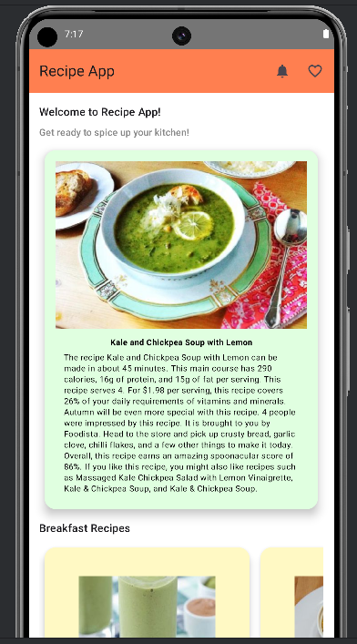
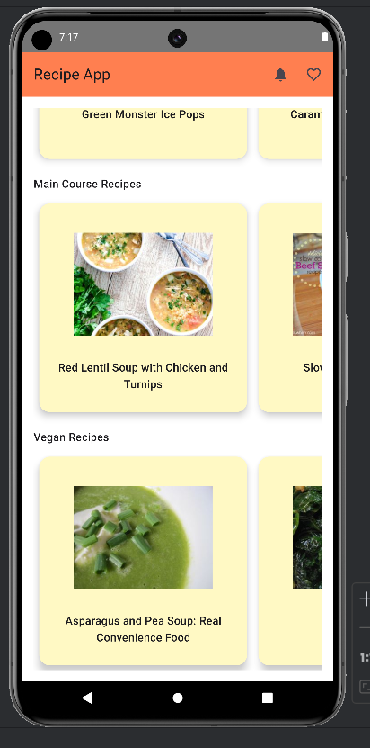
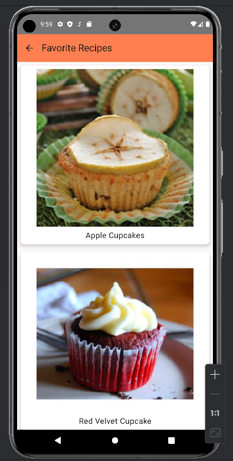

# RecipeFinder App

## Description

RecipeFinder is a mobile application that allows users to discover and save their favorite recipes.

## Features

- Browse through a collection of recipes.
- View detailed information for each recipe, including cooking instructions and nutritional information.
- Save your favorite recipes for easy access.
- Search for recipes based on ingredients or categories.

## Screenshots

## Getting Started

1. Clone this repository to your local machine.
2. Open the project in Android Studio.
3. Build and run the app on an emulator or a physical device.

## Dependencies

- Kotlin
- Jetpack Compose
- Hilt for dependency injection
- Navigation component for navigation

## Contributing

Contributions are welcome! If you find any issues or have suggestions for improvement, please feel free to open an issue or create a pull request.

## License

This project is licensed under the MIT License - see the [LICENSE](LICENSE) file for details.
